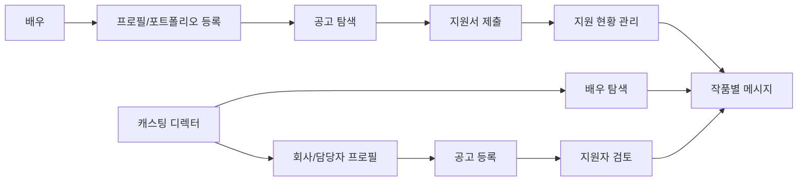

<p align="center">
  
</p>

<h1 align="center">Cast-In</h1>

<p align="center">
  배우와 캐스팅 디렉터를 연결하는 역할 기반 캐스팅 워크플로우 플랫폼
</p>

<p align="center">
  
  
  
  
  
</p>

## Demo

배포된 서비스는 [https://cast-in.app](https://cast-in.app)에서 확인할 수 있습니다. 아래 씨드 계정으로 로그인하면 배우와 캐스팅 디렉터 화면을 각각 확인할 수 있습니다.

| 구분 | 이름 | 아이디 | 비밀번호 |
| --- | --- | --- | --- |
| 배우 계정 | 박예원 | `seed-actor-01@cast-in.dev` | `seedPass123!` |
| 캐스팅 계정 | 김다은 | `seed-casting-01@cast-in.dev` | `seedPass123!` |

## Overview

Cast-In은 흩어진 캐스팅 과정을 하나의 제품 안에서 정리하는 웹 애플리케이션입니다. 배우는 공고를 탐색하고 프로필과 포트폴리오로 지원하며, 캐스팅 디렉터는 공고와 지원자를 관리하고 배우와 메시지를 주고받을 수 있습니다.

제품 운영에 필요한 인증, 권한 정책, private storage, signed URL, Server Actions, 실시간 메시지, 추천 정렬까지 포함해 캐스팅 업무 흐름을 실제 서비스에 가깝게 구현했습니다.

## Problem

캐스팅 시장은 아직 메일, 커뮤니티, 구글시트, 메신저처럼 분산된 도구에 많이 의존합니다.

| 사용자 | 문제 |
| --- | --- |
| 배우 | 공고가 여러 채널에 흩어져 있고, 지원 이후 진행 상황을 한곳에서 확인하기 어렵습니다. |
| 캐스팅 디렉터 | 지원자 프로필과 포트폴리오를 메일로 하나씩 확인하고, 상태 관리를 외부 시트에 의존해야 합니다. |
| 양쪽 모두 | 작품 맥락이 빠진 채널에서 소통하면서 어떤 공고와 관련된 대화인지 놓치기 쉽습니다. |

Cast-In은 공고 탐색, 지원, 지원자 관리, 메시지, 알림을 하나의 역할 기반 IA 안에 묶어 이 흐름을 줄입니다.

## Key Features

### For Actors

- 역할, 지역, 장르, 성별/연령 조건 기반 공고 탐색
- 배우 프로필, 대표 이미지, 필모그래피, 수상 내역, 포트폴리오 관리
- 프로필과 지원 사유, 첨부 파일을 함께 제출하는 공고 지원
- 지원 상태별 목록, 결과 확정 전 지원 철회
- 작품별 캐스팅 담당자와 1:1 메시지
- 관심 공고 저장, 인앱 알림, 알림 수신 설정

### For Casting Directors

- 조건과 분위기에 맞는 배우 탐색, 필터링, 추천순 정렬
- 배우 프로필, 포트폴리오, 경력, 태그 기반 검토
- 공고 등록, 공고 미디어 업로드, 지원 질문 설정
- 공고별 지원자 테이블과 지원 상태 관리
- 지원자와 작품 맥락이 연결된 메시지
- 관심 배우 저장, 지원/메시지 알림 관리

### Shared Experience

- 이메일/비밀번호 인증, 이메일 확인, 비밀번호 재설정
- 역할 선택 온보딩과 역할별 네비게이션
- Realtime 메시지 수신과 읽음 처리
- private bucket 기반 파일 업로드와 signed URL 렌더링
- 계정 설정, 활동 모드, 알림 수신 설정, 계정 삭제 플로우

## Product Flow



## Technical Highlights

| Area | Implementation |
| --- | --- |
| App architecture | Next.js 16 App Router, React 19, Server Components, Server Actions |
| Data and auth | Supabase Auth, PostgreSQL, RLS, column grants, RPC |
| Realtime | Supabase Realtime 기반 메시지 insert/update 구독 |
| File security | `avatars`, `portfolio`, `job-media`, `attachments` private bucket과 signed URL 변환 |
| Authorization | 브라우저 select에서 PII 컬럼 제외, draft/closed 공고와 지원 질문 노출 제한 |
| Recommendation | 배우 프로필과 공고 조건을 비교하는 규칙 기반 match score와 match reason |
| Hardening | CSP, Referrer-Policy, X-Frame-Options, Permissions-Policy, production HSTS |

## Tech Stack

| Category | Stack |
| --- | --- |
| Language | TypeScript |
| Framework | Next.js 16 App Router |
| UI | React 19, Tailwind CSS 4, Base UI 기반 로컬 컴포넌트, shadcn CLI |
| Backend | Server Components, Server Actions, Route Handlers |
| Database | Supabase PostgreSQL |
| Auth | Supabase Auth email/password |
| Storage | Supabase Storage private buckets |
| Realtime | Supabase Realtime |
| Validation | Zod |
| Icons and UI utilities | lucide-react, class-variance-authority, sonner, date-fns |

## Project Structure

```text
app/
  (public)/            # landing, login, signup
  (app)/               # authenticated role-based product surface
  onboarding/          # role and profile onboarding
components/
  features/            # product-specific UI
  ui/                  # reusable local UI primitives
lib/
  queries/             # server-side data access
  supabase/            # browser/server/proxy/admin clients
  recommendations.ts   # rule-based matching score
supabase/
  migrations/          # PostgreSQL schema, RLS, storage policies, triggers
docs/
  security-audit.md    # security and architecture review notes
scripts/
  seed.mjs             # demo data seeding
```

## Getting Started

### Prerequisites

- Node.js 20+
- pnpm 9.15.4
- Supabase project or local Supabase CLI environment

### Installation

```bash
pnpm install
cp .env.local.example .env.local
pnpm dev
```

The app runs at [http://localhost:3333](http://localhost:3333).

### Environment Variables

```bash
NEXT_PUBLIC_SUPABASE_URL=
NEXT_PUBLIC_SUPABASE_PUBLISHABLE_KEY=
SUPABASE_SERVICE_ROLE_KEY=
```

Older Supabase projects can use `NEXT_PUBLIC_SUPABASE_ANON_KEY` instead of `NEXT_PUBLIC_SUPABASE_PUBLISHABLE_KEY`. `SUPABASE_SERVICE_ROLE_KEY` is server-only and must never use a `NEXT_PUBLIC_` prefix.

### Database Migrations

Supabase migrations live in `supabase/migrations`.

```bash
pnpm dlx supabase@latest db push
pnpm dlx supabase@latest migration list
```

Auth settings are tracked in `supabase/config.toml`:

- site URL: `http://localhost:3333`
- callback URL: `/auth/callback`
- email confirmation enabled
- minimum password length: 8, letters + digits required
- TOTP MFA enabled

### Demo Data

The seed script requires the server-only Supabase key.

```bash
node --env-file=.env.local scripts/seed.mjs
node --env-file=.env.local scripts/seed.mjs --reset
node --env-file=.env.local scripts/seed.mjs --avatars-only
node --env-file=.env.local scripts/seed.mjs --deadlines-only
```

## Scripts

| Command | Description |
| --- | --- |
| `pnpm dev` | Start the Next.js dev server on port 3333 |
| `pnpm build` | Build for production |
| `pnpm start` | Start the production server on port 3333 |
| `pnpm lint` | Run ESLint |
| `pnpm audit --prod` | Audit production dependencies |

## Security Notes

Cast-In treats Supabase RLS as a first-class authorization boundary, not just a client-side filtering layer.

- PII fields such as email, contact, and business number are excluded from browser-readable grants.
- Actors only read open, non-expired jobs unless they are already involved through an application.
- Casting owners can manage their own jobs, applicants, and application statuses.
- Messages can only be inserted by room participants, and updates are constrained to read state.
- File rows store private storage paths and metadata, not long-lived public URLs.
- External links are normalized to `http:` and `https:` only.
- Auth callback redirects only allow internal paths.

Detailed review notes are maintained in [docs/security-audit.md](./docs/security-audit.md).

## Roadmap

- [x] Role-based onboarding and authenticated IA
- [x] Actor/casting profiles and portfolio uploads
- [x] Job creation, search, detail, application, and applicant management
- [x] Realtime messages, attachments, read state, and notifications
- [x] Private storage buckets and signed URL rendering
- [x] Rule-based recommendation score for actors and jobs
- [ ] Media and application question editing on job edit pages
- [ ] Profile visibility controls and public profile polish
- [ ] Recommendation improvements using bookmarks, applications, and profile views
- [ ] Server Action, RLS smoke, and browser flow test coverage
- [ ] Production deployment checklist and license decision

## Maintainers

Cast-In Team
